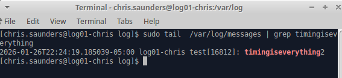

# Lab #2: Time Zones and Logging

## RW01 Setup

To begin this lab, on all of the current systems but for this first step more specifically, rw01, I had to go in and change the format of the rsyslog service to log in the extended time format for the logs so that it can show the timezone and the fulle extended time. To do this, I went into the configuration file for the service and commented out the line that said "ActionFileDefaultTemplate RSYSLOG TraditionalFileFormat". Once the line was commented out the log format looked like the screenshot below in deliverable 1.

## Deliverable 1

The screenshot below shows the rw01 VM and the rsyslog in the proper time format.

<figure><figcaption></figcaption></figure>

## Web01 and Log01 Setup

After doing this on rw01, I did the exact same thing on log01 and web01. The deliverables below show the screenshots detailing the changes.

## Deliverable 2

The screenshot below shows the before and after changes to the rsyslog service on web01.

## Deliverable 3

The screenshot below shows the before and after changes to the rsyslog service on log01.

