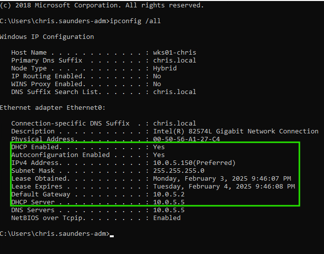

# Lab #2: DHCP

## Intro and Overview

This lab covered a more in depth view of DHCP compared to the previous classes in which this was covered. This included not only setting up DHCP but also covered how to make some basic scripts that will format the output to how you want it to be. In this case, the goal was to create a script that would output the DHCP assignment of the machine in a formatted way without all the additional information.

## Setting Up DHCP

In order to set up the DHCP assignments on my machine, we had used the windows DHCP feature on one of our domain controllers in this environment.

In order to get this it first had to be installed by navigating to the "manage -> add roles and features -> role based or feature based installation -> select the desired domain controller -> server roles -> DHCP" and then installing the feature. Once installed, it was as simple as setting up the parameters and boundaries of the DHCP including all reservations and all pools and then assigning the desired machines to point to my domain controller for their DHCP assignments. Below is a screenshot from my workstation once I got the DHCP assignments to work.

<figure><figcaption></figcaption></figure>

## Scripting a Network Config Command Output

The second part of this week's work was to focus on the scripting and the formatting of a script to get an output that was desireable for the user. In this case, I had used powershell to format the output of the   ipconfig /all output as well as the current user to give an output like the sample below taken from my workstation.

<figure><figcaption></figcaption></figure>

This was achieved by running my dhcp\_check.ps1 script that can be seen below. This basically just formats the output of the commands to do a quick check of the current machine's networking and user.

<figure><figcaption></figcaption></figure>
