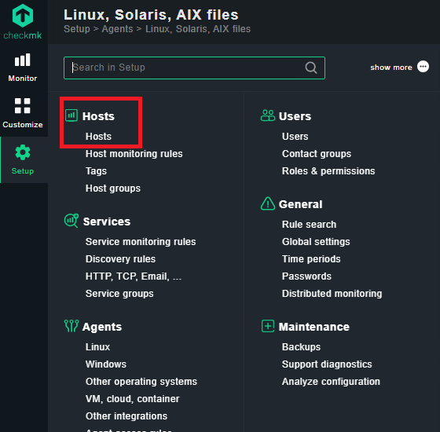

# Project: Network Monitoring

## CheckMK Overview

CheckMK is the tool that our group decided to use. It has capabilities to monitor both Linux and windows machines with relative ease through the use of an agent installed on the machine. We had found CheckMK through the provided resources and decided to use it based on its high versatility and generally clean looking GUI.

## Implementation Steps

### Main Server

Firstly, we needed to install docker on the machine as we decided to use a docker image provided by the service providers (CheckMK).&#x20;

```bash
# Download and Install Docker on Rocky Linux
sudo dnf check-update -y
echo "Adding repo to package manager"
sudo dnf config-manager --add-repo https://download.docker.com/linux/
centos/docker-ce.repo -y
echo "Installing docker"
sudo dnf install docker-ce docker-ce-cli containerd.io -y
echo "Starting docker"
sudo systemctl start docker
echo "Enablinging docker"
sudo systemctl enable docker
sudo systemctl status docker

# Script used to install checkmk container and fetch password
sudo docker container run -dit -p 8080:5000 -p 8000:8000 --tmpfs /opt/omd/
sites/cmk/tmp:uid=1000,gid=1000 -v monitoring:/omd/sites --name checkmk -v /
etc/localtime:/etc/localtime:ro --restart always checkmk/check-mk-raw:2.3.0-latest

# get password
sudo docker container logs checkmk

```

### Agent Installations

For the install, the hosts that we wish to monitor have to have the CheckMK agent installed ion the local machine so that it can communicate with the server instance. Below, I have listed the commands needed to install the client on Linux machines and Windows machines respectively. In both instances the curly brackets indicate a link or path that must be retrieved from your specific CheckMK installation.

#### Linux Agent

```bash
# Install wget
Sudo yum install wget -y

# Use wget to download the files from your CheckMK server
Wget http://{web server IP}:{port}/{path to directory}/
check-mk-agent_2.3.0p25-1.noarch.rpm

# Install the service
Sudo dnf install check-mk-agent_2.3.0p26-1.noarch.rpm -y

# Enable the ports on the firewall
Sudo firewall-cmd –permanent –add-port 6556/tcp
Sudo firewall-cmd –permanent –add-port 6556/udp
Sudo firewall-cmd –reload

# Check the status and start the service
Systemctl start check-mk-agent
Systemctl status check-mk-agent

```

#### Windows Agent

```powershell
# Use curl to download the files from your CheckMK server
Curl http://{web server IP}:{port}/{path to directory}/check_mk_agent.msi

# Run the installer
Msiexec {path to downloaded msi}

```

Something of note for the windows machine agent, when running the above command there will be a GUI menu in which you must select "clean install" for the installation to work properly, especially if you have configured the agent on the machine already.

## Adding Hosts in CheckMK

Start by getting to the hosts menu in the newly installed web portal running on the port that was configured in the previous part. The menu should look similar to the screenshot below.

<figure><figcaption></figcaption></figure>

Once in this menu, select that you want to add a host as seen below:

<figure><figcaption></figcaption></figure>

Enter the hostname of the desired machine that you wish to join to the monitoring panel as well as any other prompted information through the joining steps. Once filled out and saved, it is important to run the service discovery to validate that the machine running CheckMK can see the hosts.

<p align="center"></p>

<figure><figcaption></figcaption></figure>

Finalize any changes by selecting the yellow stop sign and refreshing the local server by clicking the red button as seen below. This, in essence, commits the changes to the CheckMK server.

<figure><figcaption></figcaption></figure>

### Setting Flags / Checks

To set a flag or a check using the web service, go to the main settings menu in the left side bar, select services, and then service monitoring rules.

<figure><figcaption></figcaption></figure>

Proceed to the services menu and select the desired service to monitor. For the purposes of this activity, we selected the file system usage. Once in the rule, we can set the desired levels that we want to trigger a warning and set a different level for a critical flag.

<figure><figcaption></figcaption></figure>

## Common Troubleshooting

Make sure to change and enable the firewall rules when installing any agents onto a linux host, otherwise the host will not be able to communicate with the server. Windows will automatically complete this task through the MSI installer.

## Pros and Cons

### Pros

* It is relatively easy to set up
* Provides many monitoring options
* Dashboard is clean and user friendly

### Cons

* Slow to update; newly applied changes take several minutes to take action&#x20;
* Saving after every change can be tedious

## Would we Recommend the Tool

With no prior knowledge in any other monitoring system I found check-mk to be easy to set up with clear documentation. The UI was intuitive and installing agents was two commands. I would personally recommend check-mk to someone looking for a monitoring solution.

## Video Demo


