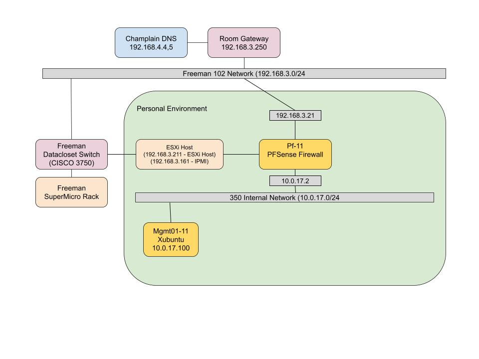

# Lab #1: VMWare ESXi Installation

## Overview

This lab will cover a broad range of topics including but not limited to the following:

* Flashing an ISO to a physical server
* Installing and configurating a type 1 hypervisor (VMware ESXi)
* Creating datastores on ESXi
* Creating Virtual Networking on ESXi
* Creating and managing basic VMs on ESXi

## Installing the ESXi host

In this case, I was installing the bootable files via USB drive so we started by flashing the ISO to a USB via Rufus. Once that was completed and the networking on the physical server was completed, I plugged in the USB into the server blade and restarted the server leading to the automatic start of the install. Once completed, the boot installation started as shown by the screenshot below:

<figure><figcaption></figcaption></figure>

Once the core services and tools were installed, it came time to select a disk for the install of the boot partition. Below I have a screenshot showing the options for the selection of which disk to install onto. In this case, I selected the 500 GB internal drive and left the TB drive for the datastore that will be used later.&#x20;

<figure><figcaption></figcaption></figure>

After selecting which drive to partition and format for install, I set a root password for the root account of the new ESXi.&#x20;

<figure><figcaption></figcaption></figure>

Once all configurations had been made, the installation was ready to start as shown below. After a chunk of time, the server was ready to reboot after removing the USB from the server.

<figure><figcaption></figcaption></figure>

<figure><figcaption></figcaption></figure>

Finally, once all of the steps for the initial install for the ESXI onto the server blade had been completed it prompted for a confirmation of actions and finally started a reboot of the system to proceed with the installation as seen above.&#x20;

## Configuring Host Networking

Once the install of the ESXi image had completed I first removed the USB installation media from the physical server blade. Then, I began the post install configrations starting with the networking.&#x20;

<figure><figcaption></figcaption></figure>

First, I selected the network adapter that I wanted to use as the default outbound network connection for the server itself, this will later functionally become the "VM Network" and is the direct link to the Freeman lab and cyber.local network.&#x20;

<figure><figcaption></figcaption></figure>

Once that was selected, I chose to edit the IP settings for the machine and filled in the settings as seen above. The IP of the machine is the assigned HOST network assignment, not the IPMI interface network assignment, and the default gateway was simply the Freeman lab default gateway IP.&#x20;

<figure><figcaption></figcaption></figure>

Next, I set the defauly DNS configurations to point towards the cyber.local DNS servers, one as a primary and the other as the secondary. I also changed the hostname of the machine at this stage to the assigned superX number, in this case my server is super11.

<figure><figcaption></figcaption></figure>

Lastly, I changed the default domain to be cyber.local to assist with the hostname resolution later down the line and have the default be more easily accessible.&#x20;

<figure><figcaption></figcaption></figure>

Once completed, I accepted the network configurations, allowed it to finalize, and then accessed my ESXi host from my browser via IP as seen in the screenshot above.&#x20;

## Deliverable 1

The following screenshot is my submission for Deliverable 1, it is the home screen after login in with the set root password in order to see my VM dashboard before configuring anything on the ESXi.&#x20;

<figure><figcaption></figcaption></figure>

## Adding/Creating Datastores

To configure and add the datastores, you first have to login to the ESXi portal via IP in the browser. Once that is done, on the homepage, select the storage menu.

<figure><figcaption></figcaption></figure>

Inside of the storage menu, at the center of the screen there is a listing of all of the datastores that are attached to the machine. In my case, there was one unconfigured SSD in my machine and the one started datastore that I had installed the ESXI onto. I started by renaming the datastore by right clicking the first datastore and the selecting rename. I then set it to the apropriate name.

<figure><figcaption></figcaption></figure>

Next, I wanted to add the second SSD as a secondary datastore on the ESXi host. To do this, I hit the new datastore button on that datastore default screen as seen below.&#x20;

<figure><figcaption></figcaption></figure>

Next, I followed the wizard to add the new datastore to my ESXI host. I first selected to create a new VMFS datastore.

<figure><figcaption></figcaption></figure>

I then selected the second Sanmsubng SSD (1TB) that I had inside of the server and added that as a datastore target. I also gave it the name datastore2-super11 at this stage to match the naming scheme for the datastores.&#x20;

<figure><figcaption></figcaption></figure>

I then waited for it to scan the disk to see how much available storage there was and in this case it was empty. I configured it to use the entire disk with this new partition and chose the VMFS 6 scheme since it was the most recent and up to date. This is the same partitioning scheme that the other datastore followed as well by default.&#x20;

<figure><figcaption></figcaption></figure>

ofr the last step of the wizard, I confrmed all of my selections before it formatted and partitioned the new drive as a secondary datastore.&#x20;

<figure><figcaption></figcaption></figure>

Once complete, the new datastore appeared in the menu as a storage location. I then used the create directory button to make a new folder called ISOs, uploaded the PFsense and Xubuntu ISOs to the new datastore from my local machine by selection upload, and then allowed them to complete uploading to the ESXi.&#x20;

<figure><figcaption></figcaption></figure>

## Deliverable 2

<figure><figcaption></figcaption></figure>

Above and below are my submissions for Deliverable 2. In the screenshot above I have captured a screenshot of the two datastores as how they appear in my ESXI host from the web portal. I have both Datastore1-super11 and Datastore2-super11 which are my two internal SSDs attached to my server.

<figure><figcaption></figcaption></figure>

Above is the screenshot of my ISOs folder on datastore 2. This is a new directory that I created, uploaded the two ISOs for PFsense and Xubuntu, and stored.&#x20;

## Creating Virtual Networking

Once my datastores were configured and set up, I had to create a virtual network for my soon to be created VMs to exist on so that they can reach the outbound internet. This step entailed creating both a virtual switch and a virtual port group for the new connections.&#x20;

### Creating a Virtual Switch

To create my virtual switch, I started by navigating to the networking tab of my ESXi home page on the left right underneath storage. I then opened the virtual switches menu as seen below.&#x20;

<figure><figcaption></figcaption></figure>

Once opened, I selected the option to create a new Virtual Switch.

<figure><figcaption></figcaption></figure>

Once selected, in the popup menu for the new virtual switch I gave it the name 350-internal and kept the default MTU. Once done, I added it to my list of virtual switches as shown below.

<figure><figcaption></figcaption></figure>

### Creating a Port Group

Now that I had a virtual switch, I needed to create a virtual port group for my virtual network. To do this, I navigated back to the networking page and opened the port groups menu as seen below.&#x20;

<figure><figcaption></figcaption></figure>

Similarly to before, I selected to add a port group and the new popup menu for configuration appeared. I gave my new port group the name 350-internal, kept the VLAN ID at 0, and added it to the 350-internal virtual switch I created before.&#x20;

<figure><figcaption></figcaption></figure>

Once completed, I had three total port groups. Two of the default ones that were configured before while making the ESXi and the one new 350-internal port group on the 350-internal virtual switch as seen below.

<figure><figcaption></figcaption></figure>

## Deliverable 3

Below are my submissions for Deliverable 3. This deliverable outlines the virtual networking and that i meed the requirements for this milestone. Below I have screenshotted the two virtual switches, the one I created and the default switch, as seen from my switches menu.&#x20;

<figure><figcaption></figcaption></figure>

Next, below is a screenshot of the virtual port groups that I have on my ESXI that includes the two default ones and the new 350-internal port group.

<figure><figcaption></figcaption></figure>

## Installing VMs

The next and final part of the lab was to install and begion the process of populating my environment with VMs. For this lab, it was simply a PFSense VM and a management box that is running XUbuntu.&#x20;

### PFSense VM Install

To start the installation of PFsense ontoa  VM i needed to create a VM first. To do this, I started at the Virtual Machines menu and selected Create/register a VM.&#x20;

<figure><figcaption></figcaption></figure>

From here, I followed the wizard to install the first VM onto the system as seen below by selecting the option to create a new virtual machine.

<figure><figcaption></figcaption></figure>

I then gave the new VM a name, chose the compatibility level of the VM, selected the OS family, and the OS itself. In this case for the PFSense VM I selected the other category and then FreeBSD.&#x20;

<figure><figcaption></figcaption></figure>

Next I selected which datastore to keep the VM files on. In this case I chose the second datastore.

<figure><figcaption></figcaption></figure>

I then allocated resources to the machine. I gave it 1 core, 2GB RAM, and an 8GB hard disk that was thin provisioned. Since this was my firewall machine, it has two interface controllers, one for the VM Network switch and one for my 350-internal switch as configured before. Lastly, it has the PFSense ISO that I downloaded to my datastore earlier attached as a CD ROM for installation.&#x20;

<figure><figcaption></figcaption></figure>

<figure><figcaption></figcaption></figure>

Lastly, I confirmed all of the VM configurations and settings before creating the VM.&#x20;

<figure><figcaption></figcaption></figure>

### Xubuntu Install

I followed all the same steps to get to the VM screen as seen above from the last machine but this time I named it mgmt01-11 for the Xubuntu machine and assigned it the Ubuntu operating system.

<figure><figcaption></figcaption></figure>

I then gave it the specs as seen below, also with a thin provisioned hard drive but this time with one network interface controller temporarily for the VM network for install but then later for the internal network.&#x20;

<figure><figcaption></figcaption></figure>

<figure><figcaption></figcaption></figure>

I then confirmed and finished the VM creation menu.&#x20;

## Configuring VMs

### PFSense Configurations

Once I booted the PFsense VM, I selected that I wanted to install PFSense onto the VM's drive.

<figure><figcaption></figcaption></figure>

I selected the auto option for the ZFS format of installation. This pre-configured all of the installation settings for me making this process easier.&#x20;

<figure><figcaption></figcaption></figure>

I reviewed the defaults and then confirmed the install as seen below.&#x20;

<figure><figcaption></figcaption></figure>

I selected for this to have no redundancy because I have only one disk attached to this VM. If there were more, I would have other options but I only have one in this case.&#x20;

<figure><figcaption></figcaption></figure>

I selected the disk for installation as seen below.&#x20;

<figure><figcaption></figcaption></figure>

And lastly I started and fnished the OS installation as shown in the next three screenshots of confirming, downloading, and rebooting the VM. Note that I did remove the installation media at the time of reboot.&#x20;

<figure><figcaption></figcaption></figure>

<figure><figcaption></figcaption></figure>

<figure><figcaption></figcaption></figure>

Next, once the OS had been isntalled I booted the machien to the command line interface and begun to configure my networking settings. I started by assigning which of the NICs that I wanted for my WAN and LAN as seen below.&#x20;

<figure><figcaption></figcaption></figure>

Once complete, I was greeted by the PFSense home menu as seen in the screenshot below.&#x20;

<figure><figcaption></figcaption></figure>

From there, I selected to select interface IP addresses, started with the WAN, gave it an IP that I was assigned. In this case that IP was 192.168.3.21 for my WAN firewall connection. Assigned the subnet mask length, and provided it with the upstream gateway IP address.&#x20;

<figure><figcaption></figcaption></figure>

I opened the same menu and selected LAN this time, assigned it the 10.0.17.2 address and 24 bit length subnet mask, and left the upstream gateway values blank. For all other configurations for both LAN and WAN I left as default or disabled.&#x20;

<figure><figcaption></figcaption></figure>

Once finished, the interfaces were setup as seen below and the router itself could ping and resolve names outside of the network.&#x20;

<figure><figcaption></figcaption></figure>

<figure><figcaption></figcaption></figure>

Next, I moved over to my XUbuntu machine for the remaining configurations. I reset the login for the admin account for the pfsense configuration portal at this time after using teh default PFSense login.&#x20;

<figure><figcaption></figcaption></figure>

I altered the hostname of the machine to reflect the VM name as seen below.

<figure><figcaption></figcaption></figure>

I made sure that my time zone was configured properly, a good habit to follow on any new machine.&#x20;

<figure><figcaption></figcaption></figure>

And lastly, I finished and confirmed my changed thus completely setting up my firewall!

<figure><figcaption></figcaption></figure>

### Xubnutu Configurations

To start with the Xubuntu configurations, I started on the VM network for this process and then later changed it to the internal netowrk and assigned IPs for it. First I selected the language and installed XUbuntu onto the disk.&#x20;

<figure><figcaption></figcaption></figure>

I confirmed the keyboard language layout as seen below.&#x20;

<figure><figcaption></figcaption></figure>

I opted for the minimal installation to omit any unnecessary processes or software as part of the install.&#x20;

<figure><figcaption></figcaption></figure>

I chose to erase any data on the newly created vhd for the VM, in this case it was already empty but confirmed my decisions nonetheless.&#x20;

<figure><figcaption></figcaption></figure>

and once completed, I started the install as seen below.&#x20;

<figure><figcaption></figcaption></figure>

While installing, I selected the time zone for this machine as seen below.&#x20;

<figure><figcaption></figcaption></figure>

And lastly, I created a default user account. This VM will be used later as a template so the default user was a basic and generic user with a generic password.&#x20;

<figure><figcaption></figcaption></figure>

Once done, the install begun and I had waited for it to complete.

<figure><figcaption></figcaption></figure>

<figure><figcaption></figcaption></figure>

Once completed, before I continued and did anything as shown below, I snapshotted the VM and labeled this as base. Then I started the VM again and proceeded with the steps below.

I set the new network to be my internal network both in the VM's settings in ESXi and in the network setting of XUbnutu as seen below, assigning it a new IP, subnet mask, gateway, and DNS server.&#x20;

<figure><figcaption></figcaption></figure>

## Deliverable 4

Once the above steps were completed, I was able to create my deliverable for number 4. Below is a screenshot from my XUbuntu machine with the deployer account that I created earlier, on the internal network with the proper IP. Below I have listed the network configurations and successfully pinged google.com from my VM.&#x20;

<figure><figcaption></figcaption></figure>

## Current Network Diagram

Below is a running draft of the network diagram as of the end of this lab. Currently it is sparse, but as we progress more machines will be added to the system for administration.&#x20;

The legend for the color-coding is as follows:

* All Champlain College devices, workstations, and networking equipment is in blue
* All Freeman lab hardware is in red
* All networks are in grey with their connections attached to them
* All physical servers and racks are in orange
* All VMs are in yellow

<figure><figcaption></figcaption></figure>

## Reflection

This lab was intense and there were many challenges that I faced along the way. Starting out, I had a hardware issue right off the bat with my server blade and had to switch the physical servers in the datacenter which took a lot of in class time and troubleshooting away from me. Once this was fixed and I had a new server blade I continued to flash ESXi again to it and proceeded as normal.

I also had a large scare with GitBook. I am relatively new to using GitBook at the time of writing this reflection and one thing that I did not know was that if a merge failed for any reason or was incomplete, this will save onto GitBook locally, but will not be accessible from any computer. This cause a scare for me as I had believed that my documentation for this lab was erased after completing more than 75% of the lab. Luckily, the documentation was saved on the local machine that I was using and I was able to restore it.&#x20;

Other than these two hurdles, the remainder of the lab went smoothly and provided me with a large amount of knowledge and experience about ISOs, flashing hardware and hard disks, setting up hypervisors, and creating and ESXi host from scratch.&#x20;
