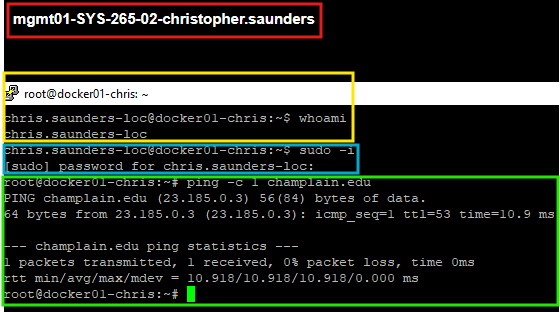
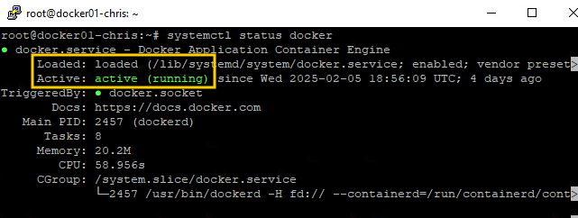
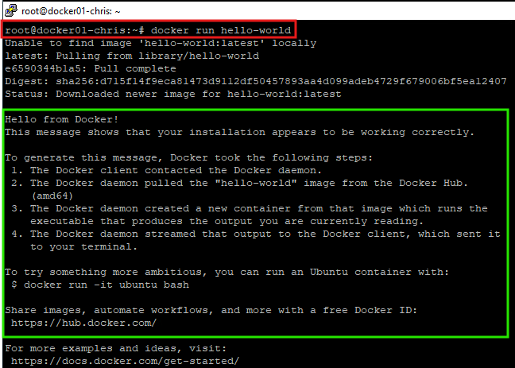
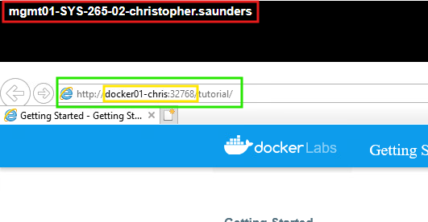

# Lab #3: Docker


## Intro and Overview

This lab introduced a new box into my current infrastructure so the first step as always was to wire and configure the box. Below you can find an outline of the changes and proof of configurations.

<figure><figcaption><p>The basic configurations of the docker box, taken from putty in the management server. The<br>docker box has a local admin, can be elevated to root, and can ping the outside world.</p></figcaption></figure>

This machine's purpose is to host docker for the multitude of tests and applications that will be run from it for the further steps of the lab. The machine has a static IP address of 10.0.5.12 and is direct into the main firewall of the infrastructure.&#x20;

### Configuring Netplan

As part of the install and since the machine is Ubuntu based, the introduction of netplan happened through this lab. Netplan is the Ubuntu local network configuration system. Below are the commands that I used to configure the Ubuntu machine and can be generalized to fit the needs of any Ubuntu machine.

```bash
sudo nano /etc/netplan/{defaultName}.yaml

#Netplan Configuration File Sample
network:
    ethernets:
       ens160:
          addresses:
             - 10.0.5.12/24 (IP address/subnet)
          routes:
             - to: default
               via: 10.0.5.2 (Gateway IP)
          nameservers:
             search: [chris.local] (Search domain)
             addresses: [10.0.5.5] (DNS Server IP)
          dhcp: false (T/F)
    version: 2
    
 sudo netplan try
 sudo netplan apply
```

These configs will allow it to connect to the internet. The last two commands can be run to either test or apply the configurations. All configurations should be tested first before implementing in case of typos or configuration mishaps.&#x20;

### Adding a Sudo User

Adding a sudo user on Ubuntu is different than any of the red hat distros that we have used so far in the classes. Below is a sample string of code that can add a user and promote to the sudo status.

```
sudo adduser {name}
Sudo usermod -aG sudo {name}

#Verification that the changes were made
groups {name}
su - {name}
sudo ls /root
```

## Installing Docker on Ubuntu

Listed below are some of the commands that I used to install the docker service on the machine. These can be referenced from the guide found on [Digital Ocean](https://www.digitalocean.com/community/tutorials/how-to-install-and-use-docker-on-ubuntu-20-04). This guide was paramount to assisting in the installation process as outlined in the code below.

```bash
#Installing Docker
sudo apt update
sudp apt install apt-transport-https ca-certificates curl software-properties-common
curl -fsSL https://download.docker.com/linux/ubuntu/gpg | sudo apt-key add -
sudo add-apt-repository "deb [arch=amd64] https://download.docker.com/linux/ubuntu 
focal stable"
apt-cache policy docker-ce
sudo apt install docker-ce
sudo systemctl enable docker
sudo systemctl start docker
sudo systemctl status docker

#Installing Docker-compose
sudo curl -L "https://github.com/docker/compose/releases/download/1.29.2/
docker-compose-$(uname -s)-$(uname -m)" -o /usr/local/bin/docker-compose
sudo chmod +x /usr/local/bin/docker-compose
docker-compose --version
```

This is the basics of getting the docker instance up and running on the ubuntu machine, this basically gets the packages listed from the inputted docker link to the software and also downloads the docker gpg keys needed for the install. Once that is done, you should get a screen similar to the one below showing the docker service is running as intended.

<figure><figcaption><p>Docker status is showing active and running after installing using the CLI</p></figcaption></figure>

## Functions of Docker

There are an infinite amount of uses and functions of docker but in this section I will outline some of the ones that were covered in the lab and that are fundamental to using docker.

### Docker Hello World

One of the basic tests that you can use for docker is to run the docker hello world test for your instance. To do so, the command below can be used. The screenshot after is a sample output that I took from my machine.

```
docker run hello-world
```


<figure><figcaption><p>This is the output from running docker's image for "hello-world"</p></figcaption></figure>

This can be used to test and verify that your docker installation can function and pull images from the web and from the docker databases.

### Docker Web App

Similarly to the hello-world docker image, the docker test web app can be used to test some of the functions of running a basic web application. The command below can be used to start this process. The screenshot below that is the web page that is created once the command is run. I decided to open it on my management box and in order to open it you have to use the ephemeral port assigned to it. This can be seen using the docker ps command to view running containers and open ports.

```
docker run -d -P docker/getting-started
docker ps
```


<figure><figcaption><p>The above screenshot is me accessing my dockerized web app via hostname and ephemeral port</p></figcaption></figure>

### Using Docker-Compose

Using docker-compose at first was tricky to understand but it is a super convenient and essential tool for quickly using docker. The main advantage of using this is that you can easily grab and push the ymal files for the docker compose and get boxes running much faster than doing it by hand as well as have standardized configurations that you can make in the ymal for each box. The main part of the lab that I used this for was for WordPress so that will be the example for this section. The sample files that I used for making a fully functional WordPress site can be found below.&#x20;

```bash
#Nginx Sample Configuration File

server {
        listen 80;
        listen [::]:80;

        server_name your_domain www.your_domain;

        index index.php index.html index.htm;

        root /var/www/html;

        location ~ /.well-known/acme-challenge {
                allow all;
                root /var/www/html;
        }

        location / {
                try_files $uri $uri/ /index.php$is_args$args;
        }

        location ~ \.php$ {
                try_files $uri =404;
                fastcgi_split_path_info ^(.+\.php)(/.+)$;
                fastcgi_pass wordpress:9000;
                fastcgi_index index.php;
                include fastcgi_params;
                fastcgi_param SCRIPT_FILENAME $document_root$fastcgi_script_name;
                fastcgi_param PATH_INFO $fastcgi_path_info;
        }

        location ~ /\.ht {
                deny all;
        }

        location = /favicon.ico {
                log_not_found off; access_log off;
        }
        location = /robots.txt {
                log_not_found off; access_log off; allow all;
        }
        location ~* \.(css|gif|ico|jpeg|jpg|js|png)$ {
                expires max;
                log_not_found off;
        }
}
```

```bash
#Docker-compose ymal file

version: '3'

services:
  db:
    image: mysql:8.0
    container_name: db
    restart: unless-stopped
    env_file: .env
    environment:
      - MYSQL_DATABASE=wordpress
    volumes:
      - dbdata:/var/lib/mysql
    command: '--default-authentication-plugin=mysql_native_password'
    networks:
      - app-network

  wordpress:
    depends_on:
      - db
    image: wordpress:5.1.1-fpm-alpine
    container_name: wordpress
    restart: unless-stopped
    env_file: .env
    environment:
      - WORDPRESS_DB_HOST=db:3306
      - WORDPRESS_DB_USER=$MYSQL_USER
      - WORDPRESS_DB_PASSWORD=$MYSQL_PASSWORD
      - WORDPRESS_DB_NAME=wordpress
    volumes:
      - wordpress:/var/www/html
    networks:
      - app-network

  webserver:
    depends_on:
      - wordpress
    image: nginx:1.15.12-alpine
    container_name: webserver
    restart: unless-stopped
    ports:
      - "80:80"
    volumes:
      - wordpress:/var/www/html
      - ./nginx-conf:/etc/nginx/conf.d
      - certbot-etc:/etc/letsencrypt
    networks:
      - app-network

volumes:
  wordpress:
  dbdata:

networks:
  app-network:
    driver: bridge
```

```bash
#Sample .env file

MYSQL_ROOT_PASSWORD=your_root_password
MYSQL_USER=your_wordpress_database_user
MYSQL_PASSWORD=your_wordpress_database_password
```

Also see the walkthrough for making a dockerized WordPress server on [Digital Ocean](https://www.digitalocean.com/community/tutorials/how-to-install-wordpress-with-docker-compose)
